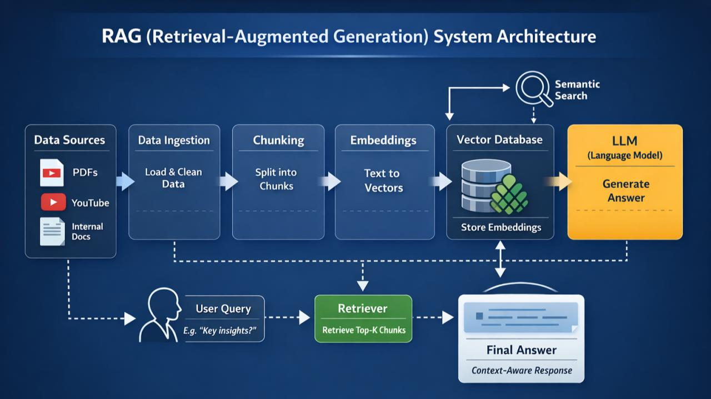

## RAG-Based AI Teaching Assistant

### Project Architecture

### Project Workflow

1. **Video → Audio**  
   Place lecture videos in the `videos` folder and convert them to audio using `convert_video_into_audio.py`. The audio files are stored in `speech`.

2. **Audio → Text**  
   Use `voice_into_text.py` to transcribe the audio into timestamped JSON chunks and save them in `output`.

3. **Text → Embeddings**  
   Convert the JSON chunks into embeddings using `convert_into_embedding.py` and store the resulting dataframe in `mydata.joblib`.

4. **Retrieval + LLM Response**  
   `check_cosine_similarity.py` compares the user query with stored embeddings, retrieves the **top 5 relevant chunks**, and sends them to the LLM to generate a grounded answer.

### Chunk Optimization

To improve retrieval accuracy, consecutive chunks from each lecture are merged into larger **5-chunk groups** and stored in `newChunks`. The same embedding and retrieval pipeline is then applied to these optimized chunks.

### Conclusion

The project uses a **RAG pipeline** to convert lecture videos into searchable knowledge and generate context-aware answers from the relevant lecture content.
